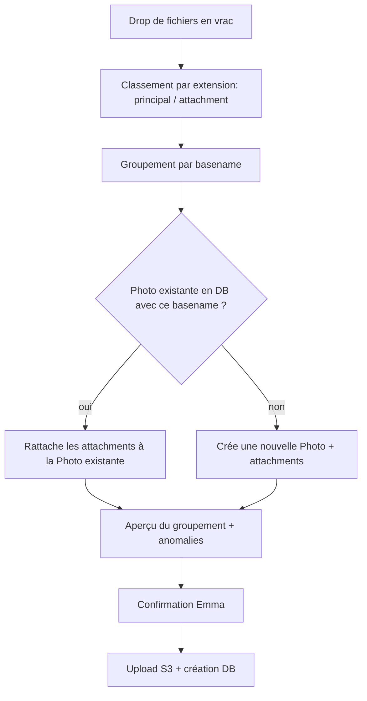

# Spec — Pièces jointes photo (RAW + XMP)

## Contexte

Emma shoote en CR2 (RAW Canon), pré-retouche dans Lightroom qui génère un sidecar XMP (réglages non-destructifs), puis exporte un JPEG localement pour prévisualisation. Elle a besoin de :

- livrer un JPEG watermarké/thumbnail au client pour la sélection (flux existant, inchangé)
- pouvoir continuer sa retouche finale depuis le CR2+XMP d'origine une fois la sélection client validée, plutôt que de repartir d'un JPEG

**Décision de principe** : pas de re-rendu RAW côté serveur (impossible à faire fidèlement — les moteurs open source comme darktable ne reproduisent qu'un sous-ensemble limité des réglages Lightroom, avec un rendu jamais identique). Le JPEG déjà exporté par Emma reste la seule source pour watermark/thumbnail. Les fichiers RAW/XMP sont traités comme des **pièces jointes opaques** : une fois accepté à l'upload, un attachment suit exactement le même traitement quel que soit son extension (stockage brut, jamais de pipeline `sharp`, restitué tel quel à la livraison) — aucune logique différenciée par format dans le code métier. La seule vérification d'extension a lieu *avant* cette étape, à l'upload, et sert un objectif différent : filtrer les fichiers parasites (voir "Anomalies" ci-dessous). Ce qui rend le système agnostique du photographe/boîtier utilisé.

## Modèle de données

Nouvelle table, relation 1-N avec `Photo` :

```
PhotoAttachment
- id
- photoId       (FK -> Photo)
- originalFilename
- s3Key
- fileSize
- mimeType / extension
- uploadedAt
```

Aucun typage "c'est un CR2" / "c'est un XMP" en base — un attachment est un fichier lié, point. La photo principale (JPEG) reste sur `Photo` comme aujourd'hui, inchangée.

## Flux d'upload

**Une seule zone de drop**, pas de bouton séparé "fichiers principaux" / "fichiers attachés". Emma dépose tout le dossier du shooting en vrac (JPEG + CR2 + XMP mélangés).

1. **Détection côté client** : par extension, chaque fichier est classé "photo principale" (jpg/jpeg) ou "attachment" (tout le reste — CR2, XMP, autres formats RAW à l'avenir).
2. **Groupement par basename** : `IMG_1234.CR2`, `IMG_1234.xmp`, `IMG_1234.jpg` → un seul groupe logique (une `Photo` + ses `PhotoAttachment`).
3. **Résolution contre l'existant** : le matching ne se fait pas seulement au sein du batch uploadé — il interroge aussi les `Photo` déjà présentes dans la collection. Nécessaire pour le cas d'un upload en deux temps (JPEG aujourd'hui, CR2+XMP quelques jours après) : sans ça, un deuxième upload créerait une `Photo` en doublon au lieu d'attacher au bon enregistrement existant.
4. **Aperçu avant confirmation** : affichage du résultat du groupement ("142 photos détectées, chacune avec CR2+XMP") pour qu'Emma valide visuellement avant l'upload effectif.
5. **Anomalies — non bloquant** :
   - JPEG sans CR2/XMP correspondant → uploadé comme photo simple, sans attachment
   - CR2/XMP sans JPEG correspondant → signalé dans l'aperçu, mais n'empêche pas l'upload du reste
   - Fichier parasite (système, caché, taille nulle — voir liste noire ci-dessous) → écarté automatiquement, jamais proposé à l'upload
   - Extension inhabituelle mais non exclue → traitée comme n'importe quel attachment valide (CR2, XMP ou autre) ; l'aperçu avant confirmation (point 4) est le vrai garde-fou : Emma voit le groupement et peut désélectionner ce qui ne devrait pas y être avant que l'upload parte réellement

**Point d'entrée unique** : le bouton "ajouter des photos" existant sur une collection sert aussi bien au premier upload qu'aux ajouts ultérieurs (ex. CR2+XMP envoyés après coup) — pas de flux dédié à créer.



## Flux de téléchargement de la sélection

Au clic "télécharger la sélection" (déclenchement manuel, ZIP généré à la demande — décision déjà actée) :

Pour chaque photo sélectionnée :
- s'il existe des `PhotoAttachment` → zippe les attachments (CR2 + XMP)
- sinon → fallback sur le fichier original (JPEG)

**Streaming obligatoire** : les CR2 pèsent 25-50 Mo pièce. Sur une sélection de 100-200+ photos, ça représente plusieurs Go. Le ZIP doit être généré en flux direct vers la réponse HTTP (ex. `archiver` en mode stream) — jamais bufferisé en mémoire, sous peine de saturer la RAM du service.

## Décisions suite à la revue de code (Claude Code)

- **Statuts autorisés pour l'upload d'attachments** : `DRAFT`, `SELECTING`, `EDITING`. Bloqué en `READY`/`ARCHIVED`. La suppression des `Photo` non-`DELIVERED` au passage en `READY` doit cascader sur leurs `PhotoAttachment` associés (sinon fichiers orphelins en S3).
- **Endpoint de téléchargement** : pas de nouvel endpoint. Extension de `streamSelectionHdZip` existant (admin-only, garde `EDITING`) — pour chaque photo sélectionnée : zippe les `PhotoAttachment` s'ils existent, sinon fallback sur le JPEG HD comme aujourd'hui. Les RAW/XMP ne transitent jamais par le flux client (`accessToken`).
- **Casse des extensions** : matching case-insensitive obligatoire (`.CR2`/`.cr2`), à traiter aussi bien à l'extraction qu'au groupement par basename.
- **Filtrage des fichiers à l'upload : liste noire, pas liste blanche**. Une liste blanche d'extensions RAW obligerait à la maintenir à chaque nouveau boîtier (Fuji, Panasonic, Hasselblad...), avec le risque de rejeter un vrai fichier légitime — contraire à l'objectif d'agnosticité boîtier. À la place, on exclut uniquement le bruit connu : fichiers système (`.DS_Store`, `Thumbs.db`, `desktop.ini`), fichiers cachés (préfixe `.`), fichiers de taille nulle. Tout le reste (CR2, XMP, NEF, format futur inconnu) est traité comme attachment potentiel. Le vrai garde-fou est l'aperçu avant confirmation (point 4 du flux d'upload), où Emma valide visuellement le groupement avant l'upload effectif.
- **Débit/timeout ZIP** : pattern de streaming déjà en place et réutilisé tel quel. À valider avant mise en prod : timeout du reverse proxy/gateway Scaleway sur un test réel avec 100+ CR2 (25-50 Mo/fichier).
- **Échecs partiels dans le ZIP** : ne plus les laisser silencieux vu la criticité (CR2 manquant = photo non retouchable). Ajout d'un fichier `_erreurs.txt` dans le ZIP listant les fichiers en échec, sans bloquer le téléchargement du reste.
- **Photos historiques sans `originalFilename`** : hors sujet — les collections de test concernées seront supprimées plutôt que migrées.
- **`confirmPhoto`/`confirmPhotosBatch`** : doivent discriminer par extension avant d'appeler `generateDerivedImages`, pour éviter de passer un CR2 dans le pipeline `sharp`.
- **Clé S3 des attachments** : pattern distinct des `Photo` principales, ex. `attachments/{collectionId}/{uuid}-{filename}`, pour éviter toute collision de path.

## Hors scope pour l'instant

- Renommage/convention d'export non standard côté Lightroom (basename différent entre CR2/XMP/JPEG) : cas non géré automatiquement, traité au cas par cas s'il se présente.
- Rattachement manuel fichier par fichier : reste un filet de sécurité, pas un flux à concevoir en détail maintenant.